# Google-Data-Analytics-Bellabeat-Case-Study

**Author**: Julie Coleman
**Date**: May, 2025

_The case study follows the six step data analysis process:_

### ❓ [Ask](#1-ask)
### 💻 [Prepare](#2-prepare)
### 🛠 [Process](#3-process)
### 📊 [Analyze](#4-analyze)
### 📋 [Share](#5-share)
### 🧗‍♀️ [Act](#6-act)

## Scenario
Bellabeat is a small high-tech company that manufactures health-focused smart products. Since it was founded in 2013 by Urška Sršen and Sando Mur, Bellabeat has opened offices around the world and now has the potential to become a larger player in the global smart device market. The company has 5 focus products at the time of this analysis: bellabeat app, leaf, time, spring, and bellabeat membership. 

## ❓ Ask
💡 BUSINESS TASK: Our team has been asked to analyze smart device data to gain insight into consumer behavior trends. The insights we discover will then help guide marketing strategy for the company. 

Specifically, our team needs to answer:
1. What are some trends in smart device usage?
2. How could these trends apply to Bellabeat customers?
3. How could these trends help influence Bellabeat's marketing strategy?

Primary stakeholders: Urška Sršen and Sando Mur, executive team members.

Secondary stakeholders: Bellabeat marketing analytics team.

## 💻 Prepare 
This data was sourced from FitBit Fitness Tracker Data and made available by the user Möbius on Kaggle at https://www.kaggle.com/arashnic/fitbit. This is a public dataset. Kaggle is a platform for data science and machine learning projects.

## 🔬 ROCCC Analysis of Dataset

| **Criterion**      | **Result** | **Assessment**                                                                                                                                       |
|--------------------|------------|------------------------------------------------------------------------------------------------------------------------------------------------------|
| **Reliable**       | ⚠️ Medium  | This is reliable enough for exploratory analysis but not for clinical research or long-term behavior modeling.                                      |
| **Original**       | ❌ No       | This is **third-party data** collected independently from Fitbit users via Amazon Mechanical Turk, not from Bellabeat’s own user base.             |
| **Comprehensive**  | ❌ No       | The dataset only spans a short period of time and does not include demographic factors.                                                            |
| **Current**        | ❌ No       | The data was collected in 2016. While it can still reveal usage patterns, it may not reflect current trends in smart device engagement.            |
| **Cited**          | ✅ Yes      | Citation: Furberg, R., Brinton, J., Keating, M., & Ortiz, A. (2016). Crowd-sourced Fitbit datasets 03.12.2016-05.12.2016 [Data set]. Zenodo. https://doi.org/10.5281/zenodo.53894 |


## ✅ Why We Consider This Good Data

| Reason                            | Details                                                                                                                                                                                                                          |
| --------------------------------- | -------------------------------------------------------------------------------------------------------------------------------------------------------------------------------------------------------------------------------- |
| 📏 **Statistically Valid Sample** | The dataset includes 30 participants — the **minimum sample size** for the [Central Limit Theorem (CLT)](https://en.wikipedia.org/wiki/Central_limit_theorem) to apply, ensuring foundational validity in statistical inference. |
| 🧠 **Credible Source**            | Collected by researchers at **RTI International**, a respected nonprofit research institute. It has a valid [DOI](https://doi.org/10.5281/zenodo.53894), and is hosted on **Zenodo**, backed by CERN & OpenAIRE.                 |
| ⏱ **Objective Measurements**      | While user-submitted, the data was **device-generated**, reducing the potential for typical biases found in self-report surveys.                                                                                              |
| 🔒 **Privacy-Respecting**         | No personally identifiable information (PII) is included — ensuring ethical data sharing.                                                                                                                                        |
| 🌍 **Open and Accessible**        | Licensed under [CC BY 4.0](https://creativecommons.org/licenses/by/4.0/) and hosted on a public, open-access platform. No proprietary software is required.                                                           |

## ⚠️ Where the Data Falls Short

| Concern                            | Details                                                                                                                                            |
| ---------------------------------- | -------------------------------------------------------------------------------------------------------------------------------------------------- |
| 📉 **Sample Size is Bare Minimum** | While statistically valid, a sample size of 30 is still **limited**. Larger samples would provide more robust insights.                            |
| 🙈 **Limited Demographics**        | Lack of demographic detail (e.g. age, gender, disability status) makes it hard to **generalize** to broader populations.                           |
| 🧩 **Manual Submission Risks**     | Manual exports introduce potential for **data corruption**, **omission**, **variability in device models**, and **user misunderstandings**, leading to misreporting during export

To begin the analysis, we load all the required R packages in https://github.com/julielaursen/r-fitbit-data. These package are used for data cleaning, manipulation, visualization, and time/date processing. 

### 📦 Packages used in this project:
- `tidyverse`: a collection of R packages for data science, including:
  - `dplyr`: For data wrangling and transformation
  - `ggplot2`: For visualizing trends and patterns
  - `readr`: For reading data files
  - `tidyr`: For reshaping and cleaning data
  - `tibble, stringr, forcats, purrr`: Support functions for tidy data workflows
- `here, skimmer, and janitor`: for simplifying data cleaning tasks

To install the tidyverse package:
  `install.packages("tidyverse")`

To load the tidyverse package: 
  `library(tidyverse)`

Then we read the data, changing each csv file into a data frame that we can execute commands against.

```r
daily_activity <- read_csv("mturkfitbit_export_4.12.16-5.12.16/Fitabase Data 4.12.16-5.12.16/dailyActivity_merged.csv")
heartrate_seconds <- read_csv("mturkfitbit_export_4.12.16-5.12.16/Fitabase Data 4.12.16-5.12.16/heartrate_seconds_merged.csv")
hourly_calories <- read_csv("mturkfitbit_export_4.12.16-5.12.16/Fitabase Data 4.12.16-5.12.16/hourlyCalories_merged.csv")
...

```

#### 🗂️ How is the data organized?

The data is organized in two different folders, one for the period of `3/12/16-4/11/16` and one for `4/12/16-5/12/16`. Although this data is supposed to be continuous, it seems that data from folder1 is incomplete. On inspection, the range of dates often stop at 4/9 which would leave a noticeable 3 day gap between the two data collections. There are also a different number of users in the dataset. For example, 35 users recorded daily activity in the first data set and only 3 in the second dataset. It seems that the user with ID `2891001357` and ID `6391747486` may have dropped out of the study between the first and second dataset. Therefore, we are only focusing on the second dataset as it is more complete.
  
#### ❓ How does it help you answer your question?

The data provides insights into users’ daily habits related to physical activity, heart rate, and sleep patterns. These insights are crucial for understanding trends and behaviors in smart device usage, which can inform Bellabeat’s marketing strategies and product improvements.

#### 🚩 Are there any problems with the data?

Yes, the summary of the dataset from the project states that there are 30 total users in the dataset. However, there are 33 people tracking their daily activity and the people who are tracking their activity are not also consistently tracking other metrics. Heartrate seconds, minutes slept, and weightlog are being tracked by less than the statistically significiant amount of people to form a valid sample. For this reason, we are eliminating some data such as weight tracking from our analysis.

```r
> n_distinct(daily_activity$Id)
[1] 33
> n_distinct(daily_calories$Id)
[1] 33
> n_distinct(daily_intensities$Id)
[1] 33
> n_distinct(daily_steps$Id)
[1] 33
> n_distinct(daily_sleep$Id)
[1] 24
> n_distinct(weight_log$Id)
[1] 8
```

## 🧹 Process

I began cleaning the data with several goals in mind. I wanted to eliminate duplication and null values. I wanted to ensure that the column names, type and format for date are consistent across tables. As I cleaned the data, I also made sure the column names were lowercase and in snake case for consistency.

The tables I am analyzing after renaming:

```r
daily_activity
daily_calories
daily_intensities
daily_steps
daily_sleep
hourly_calories
hourly_intensities
hourly_steps
minute_calories
minute_intensities
minute_METs
minute_sleep
minute_steps
heartrate_seconds
```

### 👭 Duplication and Null Rows

In minute_sleep there were 543 duplicate rows:
```r
> nrow(minute_sleep[duplicated(minute_sleep),])
[1] 543
```

In daily_sleep there were 3 duplicate rows:
```r
> nrow(daily_sleep[duplicated(daily_sleep),])
[1] 3
```

I then confirmed this by removing duplicates and comparing the rows before and after to ensure the number of rows subtracted equaled the number of rows returned in the previous command

```r
> nrow(minute_sleep)
[1] 188521
> minute_sleep_clean <- minute_sleep %>% distinct()
> nrow(minute_sleep_clean)
[1] 187978
```

```r
> nrow(daily_sleep)
[1] 413
> daily_sleep_clean <- daily_sleep %>% distinct()
> nrow(daily_sleep_clean)
[1] 410
```

Although I've checked for null and empty rows, I also want to check for rows where the values might be "0". 

```r
> nrow(daily_activity)
[1] 940

> view(daily_activity)
> daily_activity %>%
+     filter(TotalSteps == 0)
# A tibble: 77 × 16
```

Then, I remove the 77 rows of data where `TotalSteps == 0` and confirm the new number of rows is the subtracted zero rows.

```r
> daily_activity <- daily_activity %>% filter(TotalSteps !=0)
> 
> nrow(daily_activity)
[1] 863
```

I then repeat this for rows where `TotalDistance` is 0, removing one more row in the `daily_activity` table, and I begin filtering other 0 values in other tables:

```r
> daily_calories <- daily_calories %>% filter (Calories !=0)
```
removes 4 rows

Duplicate columns are also a potential problem, as both Daily Activity and Daily Calories includes a column for Calories:

```r
> colnames(daily_activity)
 [1] "Id"                       "ActivityDate"            
 [3] "TotalSteps"               "TotalDistance"           
 [5] "TrackerDistance"          "LoggedActivitiesDistance"
 [7] "VeryActiveDistance"       "ModeratelyActiveDistance"
 [9] "LightActiveDistance"      "SedentaryActiveDistance" 
[11] "VeryActiveMinutes"        "FairlyActiveMinutes"     
[13] "LightlyActiveMinutes"     "SedentaryMinutes"        
[15] "Calories"                 "DayOfWeek"

> colnames(daily_calories)
[1] "Id"           "ActivityDate" "Calories"     "DayOfWeek"
```

### 🖋️ Formatting

Daily tables of activity were in long format, but the data in csvs that calculated by minutes came in two different versions. There were tables in long format and tables in wide format. I found the tables in wide format difficult to read. For example,

**Minute Calories (Wide)**

```r
> colnames(minute_calories_wide)
 [1] "Id"           "ActivityHour" "Calories00"   "Calories01"   "Calories02"   "Calories03"   "Calories04"   "Calories05"  
 [9] "Calories06"   "Calories07"   "Calories08"   "Calories09"   "Calories10"   "Calories11"   "Calories12"   "Calories13"  
[17] "Calories14"   "Calories15"   "Calories16"   "Calories17"   "Calories18"   "Calories19"   "Calories20"   "Calories21"  
[25] "Calories22"   "Calories23"   "Calories24"   "Calories25"   "Calories26"   "Calories27"   "Calories28"   "Calories29"  
[33] "Calories30"   "Calories31"   "Calories32"   "Calories33"   "Calories34"   "Calories35"   "Calories36"   "Calories37"  
[41] "Calories38"   "Calories39"   "Calories40"   "Calories41"   "Calories42"   "Calories43"   "Calories44"   "Calories45"  
[49] "Calories46"   "Calories47"   "Calories48"   "Calories49"   "Calories50"   "Calories51"   "Calories52"   "Calories53"  
[57] "Calories54"   "Calories55"   "Calories56"   "Calories57"   "Calories58"   "Calories59"
```

**Minute Calories (Narrow)**

```r
> colnames(minute_calories_narrow)
[1] "Id"             "ActivityMinute" "Calories"
```
The wide version of the calories by minute table logs a row for each activity hour and then use the columns to represent calories burned in each specific minute of an hour. For example Calories00 would represent the calories burned in the first minute of the hour. I found this not to be ideal for understanding the data, so I renamed each file from `minute_value_narrow` to `minute_value` and ignored the files `minute_value_wide` except for comparison value.

```r
> minute_calories <- minute_calories_narrow
> rm(minute_calories_narrow)
> minute_intensities <- minute_intensities_narrow
> rm(minute_intensities_narrow)
> minute_METS <- minute_METS_narrow
> rm(minute_METS_narrow)
> minute_steps <- minute_steps_narrow
> rm(minute_steps_narrow)
```

### 🕰️ DateTime

Dates were also inconsistent across tables. Before analysis, I also needed to convert these dates in date or character format to *date time* format.

| Table                       | Date/Time Column | **Current Type** | **Needed Type** | Granularity | Value     |
| --------------------------- | ---------------- | ---------------- | --------------- | ----------- | -----     |
| `daily_activity`            | `ActivityDate`   | character        | Date            | Daily       | 4/12/2016 |
| `daily_calories`            | `ActivityDay`    | character        | Date            | Daily       | 4/12/2016 |
| `daily_intensities`         | `ActivityDay`    | character        | Date            | Daily       | 4/12/2016 |
| `daily_steps`               | `ActivityDay`    | character        | Date            | Daily       | 4/12/2016 | 
| `daily_sleep`               | `SleepDay`       | character        | Date            | Daily       | 4/12/2016 12:00:00 AM |
| `hourly_calories`           | `ActivityHour`   | character        | POSIXct         | Hourly      | 4/12/2016 12:00:00 AM |
| `hourly_steps`              | `ActivityHour`   | character        | POSIXct         | Hourly      | 4/12/2016 12:00:00 AM |
| `hourly_intensities`        | `ActivityHour`   | character        | POSIXct         | Hourly      | 4/12/2016 12:00:00 AM |
| `minute_calories`           | `ActivityMinute` | character        |  POSIXct        | Minute      | 4/12/2016 12:00:00 AM |
| `minute_intensities`        | `ActivityMinute` | character        | POSIXct         | Minute      | 4/12/2016 12:00:00 AM |
| `minute_METS`               | `ActivityMinute` | character        | POSIXct         | Minute      | 4/12/2016 12:00:00 AM |
| `minute_sleep`              | `date`           | character        | POSIXct         | Minute      | 4/12/2016 2:47:30 AM  | 
| `minute_steps`              | `ActivityMinute` | character        | POSIXct         | Minute      | 4/12/2016 12:00:00 AM |
| `heartrate_seconds`         | `Time`           | character        | POSIXct         | Second      | 4/12/2016 7:21:00 AM  |

To convert the MM/DD/YYYY columns from character to Date in the daily dataframes, I used the `lubridate` library to convert the dates to the correct format and then the class function to verify. For time, I want to use `POSIXct` as it's easier to manipulate and run mathematical operations against.

```r
daily_activity$ActivityDate <- mdy(daily_activity$ActivityDate)
> class(daily_activity$ActivityDate)
[1] "Date"
> daily_calories$ActivityDay <- mdy(daily_calories$ActivityDay)
> class(daily_calories$ActivityDay)
[1] "Date"
> daily_intensities$ActivityDay <- mdy(daily_intensities$ActivityDay)
> class(daily_intensities$ActivityDay)
[1] "Date
> daily_steps$ActivityDay <- mdy(daily_steps$ActivityDay)
> class(daily_steps$ActivityDay)
[1] "Date"
> daily_sleep$SleepDay <- mdy(daily_sleep$SleepDay)
> class(daily_sleep$SleepDay)
[1] "Date"
```
Then I renamed the date columns to always be `ActivityDate`

```r
> daily_calories <- daily_calories %>% rename(ActivityDate = ActivityDay)
> daily_intensities <- daily_intensities %>% rename(ActivityDate = ActivityDay)
> daily_steps <- daily_steps %>% rename(ActivityDate = ActivityDay)
> daily_sleep <- daily_sleep %>% rename(ActivityDate = SleepDay)
```

For non-daily tables, I converted the date to POSIXct and renamed the column to `ActivityDate`

```r
> hourly_calories <- hourly_calories %>% 
+     rename(ActivityDate = ActivityHour) %>%  # rename column to something clean
+     mutate(
+         ActivityDate = as.POSIXct(
+             ActivityDate,
+             format = "%m/%d/%Y %I:%M:%S %p",  # match "4/12/2016 12:00:00 AM"
+             tz = Sys.timezone()              # set local time zone
+         )
+     )
> 
> 
> View(hourly_calories)
> class(hourly_calories$ActivityDate)
[1] "POSIXct" "POSIXt"
```

During this exploration, I observed that the more granular datasets varied in their date and time coverage --some tables started earlier or ended later than others.  This variation could lead to inconsistencies when comparing or merging data across sources.

**Note**

daily_sleep has the ActivityDate of midnight which equates to 00:00:00. Since all zeros do not show, it looks as if the time is not included in the date, but `table(format(daily_sleep_clean$SleepDay, "%H:%M:%S"))` proves it's there.

To ensure temporal alignment and consistency in the analysis, I standardized all time-series datasets to cover the same time window: **April 12, 2016 at 00:00:00** through **May 12, 2016 at 00:00:00**

```r
hourly_calories <- hourly_calories %>%
  filter(ActivityDate >= as.POSIXct("2016-04-12 00:00:00"),
         ActivityDate <= as.POSIXct("2016-05-12 00:00:00"))
> range(hourly_calories$ActivityDate)
[1] "2016-04-12 CDT" "2016-05-12 CDT"

> hourly_steps <- hourly_steps %>%
+     filter(ActivityDate >= as.POSIXct("2016-04-12 00:00:00"),
+            ActivityDate <= as.POSIXct("2016-05-12 00:00:00"))
> range(hourly_steps$ActivityDate)
[1] "2016-04-12 CDT" "2016-05-12 CDT"

> hourly_intensities <- hourly_intensities %>%
+     filter(ActivityDate >= as.POSIXct("2016-04-12 00:00:00"),
+            ActivityDate <= as.POSIXct("2016-05-12 00:00:00"))
> range(hourly_intensities$ActivityDate)
[1] "2016-04-12 CDT" "2016-05-12 CDT"

> minute_calories <- minute_calories %>%
+     filter(ActivityDate >= as.POSIXct("2016-04-12 00:00:00"),
+            ActivityDate <= as.POSIXct("2016-05-12 00:00:00"))
> 
> range(minute_calories$ActivityDate)
[1] "2016-04-12 CDT" "2016-05-12 CDT"
....
```

I also added in the day of the week as a new column, ex)

```r
> daily_calories$DayOfWeek <- weekdays(daily_calories$ActivityDate)
> 
> colnames(daily_calories)
[1] "Id"           "ActivityDate" "Calories"     "DayOfWeek"
```

### 🧩 Incomplete Data

Based on our analysis of the timeseries data, there are 31 total days where users could have been logging information. However, analyzing the `daily_activity` log, we only have 20 users who have logged 30 or 31 days of data.

**Daily Activity:**

Only 20 users had 30 or more days of activity logged. As user `4057192912` has only logged 3 activites after cleaning, I considered this user an outlier and I have removed this user from the data frame.

```r
> daily_activity %>%
+     group_by(Id) %>%
+     summarise(days_logged = n_distinct(ActivityDate)) %>%
+     arrange(desc(days_logged)) %>%
+     print(n = Inf)

 1 1624580081          31
 2 2022484408          31
 3 2026352035          31
 4 2320127002          31
 5 2873212765          31
 6 4319703577          31
 7 4388161847          31
 8 4445114986          31
 9 4558609924          31
10 5553957443          31
11 6962181067          31
12 8053475328          31
13 8378563200          31
14 8877689391          31
15 1503960366          30
16 1644430081          30
17 3977333714          30
18 4702921684          30
19 7086361926          30
20 8583815059          30
21 5577150313          28
22 6290855005          24
23 7007744171          24
24 6117666160          23
25 1844505072          20
26 3372868164          20
27 8792009665          19
28 2347167796          18
29 8253242879          18
30 1927972279          17
31 4020332650          17
32 6775888955          17
33 4057192912           3

daily_activity <- daily_activity %>%
  filter(Id != 4057192912)
```

🥘 **Daily Calories:**

In daily calories, 20 users also logged 30 or more days. Again, user `4057192912` was removed from the data frame.

```r
> view(daily_calories)
> daily_calories %>%
+     group_by(Id) %>%
+     summarise(days_logged = n_distinct(ActivityDate)) %>%
+     arrange(desc(days_logged)) %>%
+     print(n = Inf)

> daily_calories <- daily_calories %>%
+     filter(Id != 4057192912)
```

🏋️ **Daily Intensities:**
In daily intensities, more users have logging information. 24 users total have 30+ days logged. User `4057192912` was removed from the data frame.

```r
> daily_intensities %>%
+     group_by(Id) %>%
+     summarise(days_logged = n_distinct(ActivityDate)) %>%
+     arrange(desc(days_logged)) %>%
+     print(n = Inf)
> daily_intensities <- daily_intensities %>%
+     filter(Id != 4057192912)
```

👟 **Daily steps:**
24 users have 30+ days logged n daily steps. Again, user `4057192912` was removed from the data frame.

```r
 daily_steps %>%
+     group_by(Id) %>%
+     summarise(days_logged = n_distinct(ActivityDate)) %>%
+     arrange(desc(days_logged)) %>%
+     print(n = Inf)

> daily_steps <- daily_steps %>%
+     filter(Id != 4057192912)
```

For consistency i also removed this user from other data frames:

```r
> hourly_calories <- hourly_calories %>%
+     filter(Id != 4057192912)
```

**😴 Sleep Efficiency**

The lowest sleep efficiency ratings coem from users who logged less than 10 days, potentially throwing off the data.
 ```r
> 
> # Calculate sleep efficiency per record
> lowest_efficiency_users <- daily_merged %>%
+     filter(TotalTimeInBed > 0) %>%
+     mutate(SleepEfficiency = TotalMinutesAsleep / TotalTimeInBed) %>%
+     group_by(Id) %>%
+     summarise(
+         Avg_SleepEfficiency = mean(SleepEfficiency, na.rm = TRUE),
+         Days_Logged = n()
+     ) %>%
+     arrange(Avg_SleepEfficiency)  # Lowest efficiency first
> 
> # View the bottom users
> head(lowest_efficiency_users, 10)
# A tibble: 10 × 3
           Id Avg_SleepEfficiency Days_Logged
        <dbl>               <dbl>       <int>
 1 3977333714               0.634          28
 2 1844505072               0.678           3
 3 1644430081               0.882           4
 4 2320127002               0.884           1
 5 4558609924               0.907           5
 6 2347167796               0.910          15
 7 5553957443               0.915          31
 8 8378563200               0.919          32
 9 4445114986               0.925          28
10 4020332650               0.930           8
```
### ➕ Additional manually-added data

Some data frames include data that seems to be manually added by the user on top of the fitbit data already collected. In `daily_activity`, we can surmise that `TrackerDistance` is automatically collected by the fitbit and total distance = `TrackerDistance` + manual entry. 

```
> daily_activity %>%
+     filter(TotalDistance > TrackerDistance)
# A tibble: 15 × 16
           Id ActivityDate TotalSteps TotalDistance TrackerDistance
        <dbl> <date>            <dbl>         <dbl>           <dbl>
 1 6962181067 2016-04-21        11835          9.71            7.88
 2 6962181067 2016-04-25        13239          9.27            9.08
 3 6962181067 2016-05-09        12342          8.72            8.68
 4 7007744171 2016-04-12        14172         10.3             9.48
 5 7007744171 2016-04-13        12862          9.65            8.60
 6 7007744171 2016-04-14        11179          8.24            7.48
 7 7007744171 2016-04-18        14816         11.0             9.91
 8 7007744171 2016-04-19        14194         10.5             9.5 
 9 7007744171 2016-04-20        15566         11.3            10.4 
10 7007744171 2016-04-25        18229         13.3            12.2 
11 7007744171 2016-04-27        13541         10.2             9.06
12 7007744171 2016-04-29        20067         14.3            13.4 
13 7007744171 2016-05-02        13041          9.18            8.72
14 7007744171 2016-05-03        14510         10.9             9.71
15 7007744171 2016-05-05        15010         11.1            10.0
```
The majority of these manual entries seem to be coming from user `7007744171`

I also discovered that while most users have a single sleep session per day, a small group of users in `daily_sleep` had `TotalSleepRecords` equal to 2 or 3. 

I did not eliminate users with `TotalSleepRecords > 1` however, as these could be shift workers, people who take naps, or people who frequently wake up in the night.

### 🧩 Other Outliers

**Heartrate Seconds:**

There are potential outliers in the table for heartrate data that may be outliers:

```r
> heartrate_seconds %>%
+     filter(Value < 40) %>%
+     print(n = Inf)
# A tibble: 23 × 4
           Id ActivityDate        Value DayOfWeek
        <dbl> <dttm>              <dbl> <chr>    
 1 2022484408 2016-04-27 13:47:00    38 Wednesday
 2 2022484408 2016-04-27 13:47:15    38 Wednesday
 3 2022484408 2016-04-27 13:47:20    39 Wednesday
 4 2022484408 2016-04-27 13:47:35    39 Wednesday
 5 2022484408 2016-04-27 13:47:50    39 Wednesday
 6 2022484408 2016-04-27 13:48:35    39 Wednesday
 7 4388161847 2016-05-01 04:09:30    39 Sunday   
 8 5577150313 2016-04-15 03:57:40    39 Friday   
 9 5577150313 2016-04-15 03:57:50    39 Friday   
10 5577150313 2016-04-15 03:58:05    39 Friday   
11 5577150313 2016-04-15 03:58:20    39 Friday   
12 5577150313 2016-04-15 03:58:35    39 Friday   
13 5577150313 2016-04-15 03:59:10    39 Friday   
14 5577150313 2016-05-04 02:00:00    38 Wednesday
15 5577150313 2016-05-04 02:00:10    36 Wednesday
16 5577150313 2016-05-04 02:00:20    36 Wednesday
17 5577150313 2016-05-04 02:00:35    37 Wednesday
18 5577150313 2016-05-04 02:00:50    37 Wednesday
19 5577150313 2016-05-04 07:41:10    39 Wednesday
20 5577150313 2016-05-04 07:41:20    38 Wednesday
21 5577150313 2016-05-04 07:41:30    39 Wednesday
22 5577150313 2016-05-04 07:41:45    39 Wednesday
23 5577150313 2016-05-04 18:48:20    39 Wednesday

> heartrate_seconds %>%
+     filter(Value > 200) %>%
+     print(n = Inf)
# A tibble: 13 × 4
           Id ActivityDate        Value DayOfWeek
        <dbl> <dttm>              <dbl> <chr>    
 1 2022484408 2016-04-21 16:31:30   202 Thursday 
 2 2022484408 2016-04-21 16:31:40   203 Thursday 
 3 2022484408 2016-04-21 16:31:50   202 Thursday 
 4 2022484408 2016-04-21 16:32:00   203 Thursday 
 5 2022484408 2016-04-21 16:32:10   203 Thursday 
 6 2022484408 2016-04-21 16:32:20   203 Thursday 
 7 2022484408 2016-04-21 16:32:35   203 Thursday 
 8 2022484408 2016-04-21 16:32:40   201 Thursday 
 9 2022484408 2016-04-21 17:05:40   202 Thursday 
10 2022484408 2016-04-21 17:05:50   203 Thursday 
11 2022484408 2016-04-21 17:06:05   203 Thursday 
12 2022484408 2016-04-21 17:06:20   203 Thursday 
13 2022484408 2016-04-21 17:06:30   202 Thursday 
```

### 🫀 Heart Rate Outliers — Validity Summary

| **Condition / Scenario**                      | **Physiologically Valid?** | **Explanation**                                                                 |
|----------------------------------------------|-----------------------------|---------------------------------------------------------------------------------|
| **Elite endurance athlete at rest**           | ✅ Yes                      | Well-trained athletes may have resting HRs in the 30s                          |
| **Deep sleep or REM sleep**                   | ✅ Yes                      | HR can dip below 40 during restorative sleep phases                           |
| **Meditation or extreme relaxation**          | ✅ Yes                      | Deep parasympathetic activation may lower HR temporarily                      |
| **Beta-blocker or sedative medication use**   | ✅ Yes                      | Certain medications suppress heart rate                                       |
| **Cardiac bradycardia (clinical diagnosis)**  | ❌ Caution                  | May indicate underlying health issues; not valid for general population       |
| **Wearable/device misreading**                | ❌ No                       | Poor skin contact or optical noise may result in implausibly low readings     |
| **Data dropout or signal error**              | ❌ No                       | Gaps or sensor shifts can create fake dips in recorded HR                     |
| **High-intensity exercise (young athlete)**   | ✅ Yes                      | Trained individuals under 20 may exceed 200 BPM briefly                       |
| **VO2 max testing or all-out sprint**         | ✅ Yes                      | Max effort during lab testing or track sprint may push HR over 200 BPM        |
| **Children / teens at play**                  | ✅ Yes                      | Young people can reach HR > 200 naturally without harm                        |
| **Wearable/device spike artifact**            | ❌ No                       | Sudden jump to 230–250 for 1 reading is usually an error                      |
| **Cardiac arrhythmia or SVT**                 | ❌ Caution                  | Dangerous HR spikes may reflect a medical condition, not valid exercise data  |

Based on the results, we should be careful with the data from users `5577150313` and `2022484408`. It is possible that user `5577150313` is a well-trained athlete and this should correlate with other data from other data frames, such as a high activity count. We should also be careful with user `2022484408` who matched **both** conditions of a heartrate under 40 and over 200 in the same dataframe. 

We should also consider user `4388161847` an outlier as there is a single data point for that user's heartrate dipping below 40. The mean heartrate for this user is `66.2` so this is probably a device error. I removed this row from the table and then confirmed the removal.

```r
> heartrate_seconds <- heartrate_seconds %>%
+     filter(!(Id == 4388161847 & Value == 39))
```

**🥘 Daily Calories**:

```r
> view(daily_calories_clean)
> daily_calories %>%
+     filter(Calories < 1000) %>%
+     print(n = Inf)
# A tibble: 8 × 4
          Id ActivityDate Calories DayOfWeek
       <dbl> <date>          <dbl> <chr>    
1 1844505072 2016-05-12        665 Thursday 
2 2347167796 2016-04-29        403 Friday   
3 3977333714 2016-05-11         52 Wednesday
4 4319703577 2016-05-12        257 Thursday 
5 5553957443 2016-05-12        741 Thursday 
6 6962181067 2016-05-12        928 Thursday 
7 7007744171 2016-05-07        120 Saturday 
8 8792009665 2016-05-10         57 Tuesday
```

Fitbit uses the **Mifflin-St Jeor** formula, which estimates a Basal Metabolic Rate (BMR) for number of calories at rest (no physical activity) at a minimum of 1,000 kcal/day for a petit older woman. Therefore any outliers < 1,000 are likely not explained even by fasting alone. I removed these values from daily_calories

```r
> nrow(daily_calories_clean)
[1] 932
> daily_calories_clean <- daily_calories_clean %>% filter(Calories >= 1000)
> nrow(daily_calories_clean)
[1] 924
```
Since `daily_activities` includes data beyond just calories, I did not want to eliminate entire rows of data. I summarized the user average of calories by Id and then used the mutate function to replace users who had under 1000 calories with that specific user's average.

```r
> low_cal_count <- daily_activity_clean %>%
+     filter(Calories < 1000) %>%
+     nrow()
> 
> cat("Rows with Calories < 1000 before replacement:", low_cal_count, "\n")
Rows with Calories < 1000 before replacement: 5

> user_avg_calories <- daily_activity_clean %>%
+     group_by(Id) %>%
+     summarise(avg_calories = mean(Calories, na.rm = TRUE))

daily_activity_clean <- daily_activity_clean %>%
  left_join(user_avg_calories, by = "Id") %>%
  mutate(Calories = ifelse(Calories < 1000, avg_calories, Calories)) %>%
  select(-avg_calories)

> low_cal_count <- daily_activity_clean %>% filter(Calories < 1000) %>% nrow()
> daily_activity_clean %>%
+     filter(Calories < 1000) %>%
+     print(n = Inf)
# A tibble: 0 × 16
```

## 📊 Analyze

I decided to merge the `sleep` daily table with the `daily activity` table to give a comprehensive overview of each individual's activity and sleep patterns by ActivityDate. I removed the `DayOfWeek` column from the tables merged in so it wouldn't create redundant columns and then used an inner join to join the other two tables to daily_activity

```r
> daily_merged <- daily_activity_clean %>%
+     inner_join(daily_sleep_clean, by = c("Id", "ActivityDate")) %>%
```

### 📊 Summary of Key Metrics

```r
daily_merged %>%
+     select(TotalSteps, TotalDistance, VeryActiveMinutes, FairlyActiveMinutes, LightlyActiveMinutes, SedentaryMinutes, Calories, TotalMinutesAsleep, TotalTimeInBed ) %>%
+     summary()
   TotalSteps    TotalDistance    VeryActiveMinutes FairlyActiveMinutes LightlyActiveMinutes SedentaryMinutes
 Min.   :   17   Min.   : 0.010   Min.   :  0.00    Min.   :  0.00      Min.   :  2.0        Min.   :   0.0  
 1st Qu.: 5206   1st Qu.: 3.600   1st Qu.:  0.00    1st Qu.:  0.00      1st Qu.:158.0        1st Qu.: 631.0  
 Median : 8925   Median : 6.290   Median :  9.00    Median : 11.00      Median :208.0        Median : 717.0  
 Mean   : 8541   Mean   : 6.039   Mean   : 25.19    Mean   : 18.04      Mean   :216.9        Mean   : 712.2  
 3rd Qu.:11393   3rd Qu.: 8.030   3rd Qu.: 38.00    3rd Qu.: 27.00      3rd Qu.:263.0        3rd Qu.: 783.0  
 Max.   :22770   Max.   :17.540   Max.   :210.00    Max.   :143.00      Max.   :518.0        Max.   :1265.0  
    Calories    TotalMinutesAsleep TotalTimeInBed 
 Min.   :1141   Min.   : 58.0      Min.   : 61.0  
 1st Qu.:1861   1st Qu.:361.0      1st Qu.:403.0  
 Median :2220   Median :433.0      Median :463.0  
 Mean   :2411   Mean   :419.5      Mean   :458.6  
 3rd Qu.:2926   3rd Qu.:490.0      3rd Qu.:526.0  
 Max.   :4900   Max.   :796.0      Max.   :961.0
```

#### Some discoveries from this summary

- The mean **sedentary time** is 712 minutes, which is almost 12 hours of sedentary time a day.
- The mean **lightly active** minutes is roughly 3.5 hours
- However, for **fairly active** and **very active minutes**, users got close to the recommended 30 minutes per day. Most users engaged in very little intense exercise (some none at all).
- The mean **total steps** is 8541, with the max user getting 22,770 steps. This means users are moderately active.
- The mean **calories** were 2411
- The mean **total minutes asleep** was 419.5 which is roughly 7 hours, almost consistent with healthy guidelines but could be improved to be within the recommended 7-9 hours.
- The mean **total time in bed** was 458, meaning users spent approximately 40 minutes in bed not sleeping

### 🚴 Activity Summary

The <a href="https://www.cdc.gov/physical-activity-basics/guidelines/adults.html">CDC</a> recommends at least 150 minutes of moderate-intensity physical activity a week. This can also be 75 minutes of vigorous-intensity or an equivalent combination of mdoerate and vigorous-intensity physical activity per week. Let's look at the first full week.

```r
# Define the full week
start_date <- as.Date("2016-04-17")
end_date <- as.Date("2016-04-23")

# Prepare and inspect
summary_table <- daily_activity_clean %>%
  mutate(
    ActivityDate = as.Date(ActivityDate, format = "%m/%d/%Y"),
    ActiveMinutes = VeryActiveMinutes
  ) %>%
  filter(ActivityDate >= start_date & ActivityDate <= end_date) %>%
  group_by(Id) %>%
  summarise(
    Days_Recorded = n(),
    Total_Active_Minutes = sum(ActiveMinutes, na.rm = TRUE),
    Active_Days = sum(ActiveMinutes > 0, na.rm = TRUE),
    Total_Sedentary_Minutes = sum(SedentaryMinutes, na.rm = TRUE),
    .groups = "drop"
  ) %>%
  filter(Days_Recorded == 7) %>%
  arrange(desc(Total_Active_Minutes))

# Show table
summary_table %>%
  kable(digits = 2, caption = "Total Very Active and Sedentary Minutes (Apr 17–23, 2016)")
```

Table: Very Active and Sedentary Minutes (Apr 24–30, 2016)

|         Id| Days_Recorded| Total_Active_Minutes| Active_Days| Total_Sedentary_Minutes|
|----------:|-------------:|--------------------:|-----------:|-----------------------:|
| 5577150313|             7|                  705|           7|                    4774|
| 8053475328|             7|                  677|           7|                    7262|
| 8378563200|             7|                  588|           6|                    5005|
| 8877689391|             7|                  487|           7|                    7821|
| 2022484408|             7|                  311|           6|                    7659|
| 1503960366|             7|                  284|           7|                    6068|
| 7007744171|             7|                  257|           6|                    7582|
| 6962181067|             7|                  242|           7|                    4472|
| 4388161847|             7|                  208|           6|                    5685|
| 5553957443|             7|                  141|           3|                    4944|
| 8253242879|             7|                  141|           5|                    8704|
| 2873212765|             7|                   99|           5|                    7642|
| 2347167796|             7|                   87|           6|                    4978|
| 3372868164|             7|                   84|           5|                    7773|
| 3977333714|             7|                   69|           5|                    4955|
| 4702921684|             7|                   59|           6|                    5512|
| 8583815059|             7|                   57|           5|                    8802|
| 4558609924|             7|                   53|           6|                    7678|
| 1644430081|             7|                   49|           3|                    8918|
| 6117666160|             7|                   37|           2|                    3933|
| 1624580081|             7|                   32|           2|                    8786|
| 4445114986|             7|                   25|           1|                    6903|
| 1844505072|             7|                    4|           2|                    8949|
| 4319703577|             7|                    2|           2|                    5982|
| 2320127002|             7|                    1|           1|                    8316|
| 2026352035|             7|                    0|           0|                    5442|

Table: Very Active and Sedentary Minutes (Apr 24–30, 2016)

|         Id| Days_Recorded| Total_Active_Minutes| Active_Days| Total_Sedentary_Minutes|
|----------:|-------------:|--------------------:|-----------:|-----------------------:|
| 1503960366|             7|                  337|           7|                    5773|
| 1624580081|             7|                   44|           3|                    8784|
| 1644430081|             7|                   31|           4|                    8341|
| 2022484408|             7|                  195|           7|                    7801|
| 2026352035|             7|                    0|           0|                    4841|
| 2320127002|             7|                    3|           1|                    9132|
| 2873212765|             7|                  147|           6|                    8155|
| 3372868164|             7|                   77|           4|                    7503|
| 3977333714|             7|                  181|           6|                    5187|
| 4319703577|             7|                   40|           6|                    4436|
| 4388161847|             7|                   96|           7|                    5585|
| 4445114986|             7|                   61|           2|                    6455|
| 4558609924|             7|                   80|           6|                    7379|
| 4702921684|             7|                   53|           7|                    4928|
| 5553957443|             7|                  202|           5|                    4751|
| 5577150313|             7|                  775|           7|                    4752|
| 6962181067|             7|                  160|           6|                    4731|
| 7007744171|             7|                  188|           5|                    7234|
| 7086361926|             7|                  314|           6|                    5419|
| 8053475328|             7|                  550|           7|                    8253|
| 8378563200|             7|                  225|           5|                    4953|
| 8583815059|             7|                  146|           6|                    8216|
| 8877689391|             7|                  492|           7|                    7949|


Table: Very Active and Sedentary Minutes (May 1–7, 2016)

|         Id| Days_Recorded| Total_Active_Minutes| Active_Days| Total_Sedentary_Minutes|
|----------:|-------------:|--------------------:|-----------:|-----------------------:|
| 1503960366|             7|                  266|           7|                    5967|
| 1624580081|             7|                  193|           2|                    8866|
| 1644430081|             7|                   72|           6|                    7627|
| 2022484408|             7|                  268|           7|                    7955|
| 2026352035|             7|                    0|           0|                    4598|
| 2320127002|             7|                   25|           2|                    8861|
| 2873212765|             7|                   96|           4|                    7868|
| 3977333714|             7|                  169|           6|                    4909|
| 4319703577|             7|                   52|           5|                    5431|
| 4388161847|             7|                  263|           7|                    5634|
| 4445114986|             7|                   85|           4|                    5439|
| 4558609924|             7|                   58|           3|                    7940|
| 5553957443|             7|                  114|           4|                    4978|
| 6290855005|             7|                    8|           1|                    8144|
| 6962181067|             7|                   68|           4|                    4767|
| 7086361926|             7|                  326|           7|                    5734|
| 8053475328|             7|                  480|           5|                    8649|
| 8378563200|             7|                  364|           6|                    5419|
| 8583815059|             7|                   12|           2|                    9441|
| 8877689391|             7|                  389|           6|                    8205|

These tables show that the users who are recording activity the most (6-7 days a week) are also the users who have the most very active days. Many of these users would be in the 3rd quartile of the summary or top 25% of users, who had over 38 very active minutes per day. These users are meeting the CDC guidelines for physical activity. This is also higher than the national average, indicating that fitbit users may show a selection bias as individuals who are more health-conscious or physically active may be more likely to purchase a fitbit.

I was able to show that most users were high users. Note that the one user with only 3-4 days worth of data has been eliminated from the dataset.

```

> daily_use <- daily_activity_clean %>%
+     mutate(ActivityDate = as.Date(ActivityDate, format = "%m/%d/%Y")) %>%
+     group_by(Id) %>%
+     summarise(days_logged = n_distinct(ActivityDate), .groups = "drop") %>%
+     mutate(user_type = case_when(
+         days_logged >= 1 & days_logged <= 10 ~ "low user",
+         days_logged >= 11 & days_logged <= 20 ~ "moderate user", 
+         days_logged >= 21 & days_logged <= 31 ~ "high user"
+     ))
> 
> # Print the number of users in each group
> daily_use %>%
+     group_by(user_type) %>%
+     summarise(users = n())
# A tibble: 2 × 2
  user_type     users
  <chr>         <int>
1 high user        24
2 moderate user     8
> 
> daily_use_percent <- daily_use %>%
+     group_by(user_type) %>%
+     summarise(total = n()) %>%
+     mutate(totals = sum(total)) %>%
+     group_by(user_type) %>%
+     summarise(total_percent = total / totals) %>%
+     mutate(labels = scales::percent(total_percent))
> 
> daily_use_percent$user_type <- factor(daily_use_percent$user_type, levels = c("high user", "moderate user", "low user"))
> 
> head(daily_use_percent)
# A tibble: 2 × 3
  user_type     total_percent labels
  <fct>                 <dbl> <chr> 
1 high user              0.75 75%   
2 moderate user          0.25 25%   
> daily_use_percent %>%
+     ggplot(aes(x = "",y = total_percent, fill = user_type)) +
+     geom_bar(stat = "identity", width = 1)+
+     coord_polar("y", start=0)+
+     theme_minimal()+
+     theme(axis.title.x= element_blank(),
+           axis.title.y = element_blank(),
+           panel.border = element_blank(), 
+           panel.grid = element_blank(), 
+           axis.ticks = element_blank(),
+           axis.text.x = element_blank(),
+           plot.title = element_text(hjust = 0.5, size=14, face = "bold")) +
+     geom_text(aes(label = labels),
+               position = position_stack(vjust = 0.5))+
+     scale_fill_manual(values = c( "#d62d58","#db7980","#fc9fb7"),
+                       labels = c("High user - 21 to 31 days",
+                                  "Moderate user - 11 to 20 days",
+                                  "Low user - 1 to 10 days"))+
+     labs(title="Daily use of smart device")
> 
>
```

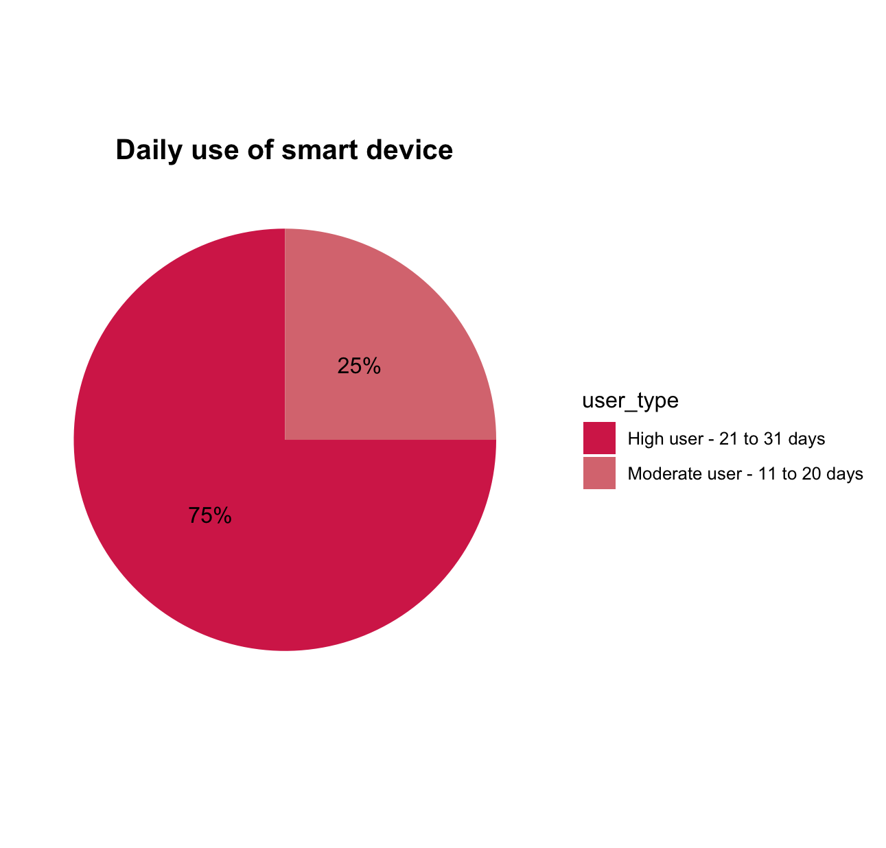

**❤️ Heartrate Data**

| Id         | Cardio    | Fat Burn | Peak     | Resting   | Total High Intensity | Meets Guidelines |
|------------|-----------|----------|----------|-----------|----------------------|------------------|
| 2022484408 | 273.75    | 5155.08  | 48.25    | 7364.92   | 322.00               | TRUE             |
| 2026352035 | 0.00      | 175.58   | 0.00     | 31.92     | 0.00                 | FALSE            |
| 2347167796 | 167.42    | 3777.33  | 28.42    | 8750.42   | 195.83               | TRUE             |
| 4020332650 | 249.50    | 13753.33 | 21.00    | 9764.58   | 270.50               | TRUE             |
| 4388161847 | 141.08    | 2707.67  | 96.58    | 17867.00  | 237.67               | TRUE             |
| 4558609924 | 159.92    | 8284.75  | 25.17    | 7544.17   | 185.08               | TRUE             |
| 5553957443 | 177.25    | 2758.50  | 1.83     | 18326.92  | 179.08               | TRUE             |
| 5577150313 | 224.08    | 4688.50  | 32.67    | 15768.08  | 256.75               | TRUE             |
| 6117666160 | 25.75     | 8129.25  | 15.50    | 5071.08   | 41.25                | FALSE            |
| 6775888955 | 45.92     | 1846.67  | 0.83     | 837.50    | 46.75                | FALSE            |
| 6962181067 | 387.33    | 7070.33  | 74.50    | 14661.67  | 461.83               | TRUE             |
| 7007744171 | 158.58    | 8528.92  | 4.25     | 2440.92   | 162.83               | TRUE             |
| 8792009665 | 9.50      | 2584.33  | 0.08     | 7642.83   | 9.58                 | FALSE            |
| 8877689391 | 1476.08   | 4060.92  | 1235.08  | 12298.00  | 2711.17              | TRUE             |

There are ten total users that meet the guidelines for physical activity ( ≥150 minutes of VeryActiveMinutes). Of those users, 6/10 also meet the CDC heart rate zone guidelines (≥75 minutes in Cardio + Peak zones). This indicates that there is a correlation between rigorous physical activity and heart health.

| Id         | Meets HR | High Intensity (min) | Week 1 | Week 2 | Week 3 | Total Min |
|------------|----------|----------------------|--------|--------|--------|-----------|
| 2022484408 | ✅       | 322.00               | 311    | 195    | 268    | 774       |
| 2026352035 | ❌       | 0.00                 | 0      | 0      | 0      | 0         |
| 2347167796 | ✅       | 195.83               | 87     | 50     | 0      | 137       |
| 4020332650 | ✅       | 270.50               | 0      | 0      | 0      | 0         |
| 4388161847 | ✅       | 237.67               | 208    | 96     | 263    | 567       |
| 4558609924 | ✅       | 185.08               | 53     | 80     | 58     | 191       |
| 5553957443 | ✅       | 179.08               | 141    | 202    | 114    | 457       |
| 5577150313 | ✅       | 256.75               | 705    | 775    | 0      | 1480      |
| 6117666160 | ❌       | 41.25                | 37     | 0      | 0      | 37        |
| 6775888955 | ❌       | 46.75                | 0      | 0      | 0      | 0         |
| 6962181067 | ✅       | 461.83               | 242    | 160    | 68     | 470       |
| 7007744171 | ✅       | 162.83               | 257    | 188    | 0      | 445       |
| 8792009665 | ❌       | 9.58                 | 0      | 0      | 0      | 0         |
| 8877689391 | ✅       | 2711.17              | 487    | 492    | 389    | 1368      |

I also inspected the users who did not meet the criteria for HR and who had lightly active minutes. These users were not completely sedentary and had an average step count of 4000-6000 per day. This shows that walking and light activity is NOT enough to meet heartrate guidelines as they do not put a user in the Peak or Fat Burning Zones. 

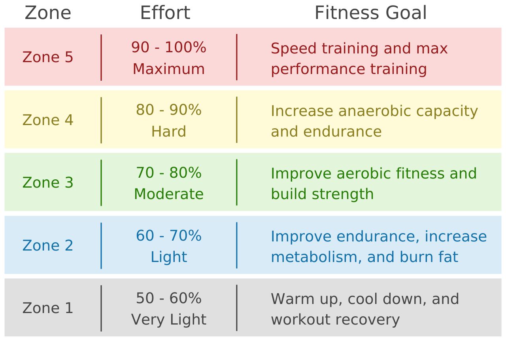
<br>

### 😴 Sleep Summary

The CDC also recommends between 7 and 9 hours of sleep. Users are getting roughly 6.98 hours of sleep on average which, after rounding, is inline with CDC guidelines.

```
> daily_sleep_clean %>%
+     mutate(SleepEfficiency = TotalMinutesAsleep / TotalTimeInBed) %>%
+     summarise(avg_efficiency = mean(SleepEfficiency, na.rm = TRUE))
# A tibble: 1 × 1
  avg_efficiency
           <dbl>
1          0.917
```

Sleep efficiency thresholds are considered good/normal, based on the National Sleep Foundation (NSF). 

| Sleep Efficiency | Result | Interpretation                                                            |
| ---------------- | --------|---------------------------------------------------------------- |
| **≥ 85%**        | ✅     | Considered normal/good                                                  |
| **75–84%**       | ⚠️     |May indicate mild sleep issues                                         |
| **< 75%**        | 🚩     |Low — may suggest poor sleep quality (e.g., insomnia, frequent waking) |

## 🫶 Share

### 🖼️ Data Visualizations
<br>
I created a series of visualizations using ggplot2 in R. To keep this summary accessible and focused on insights rather than technical details, I'm presenting only the visual outputs rather than the underlying code.
<br>
Participants recorded the most data between Tuesday-Thursday and this chart suggests that data may drop off during the weekend, when users might not feel as disciplined.
<br>
<br>
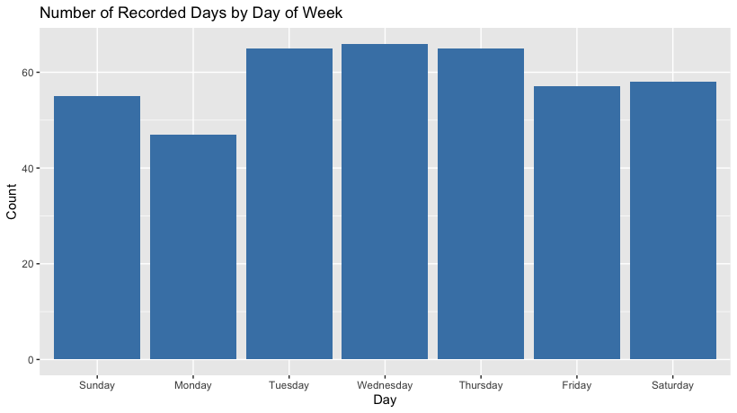
<br>
This bar graph of Average Daily Steps per user by Day of Week shows that Saturday has the highest amount of steps at almost 10,000 steps per day. This indicates that users are more likely to have more steps when they have the most free time. <br>
<br>
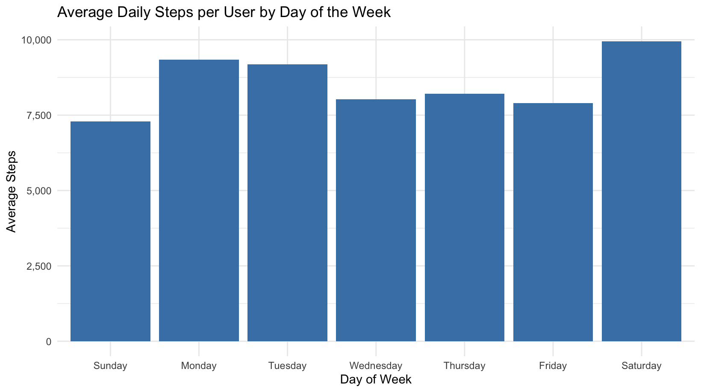
<br>

This bar graph also shows users have the most light activity on Saturdays. It is likely that users are running errands, doing housework or doing light exercise on Saturday more than on other days.  
<br>
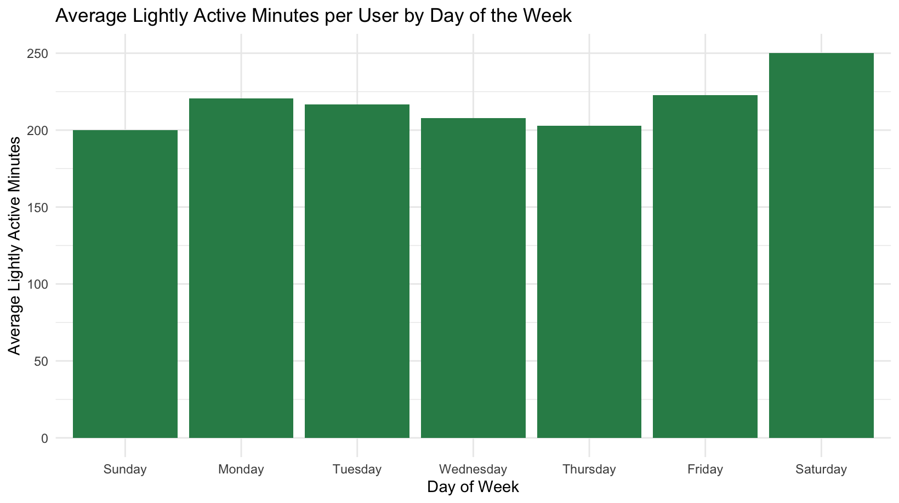
<br>

This plot shows that the users activity level by fairly, medium, or highly active. The key insights are that light activity dominates across users in both distance and time. This suggests that most users engage in light and likely unstructured movement (chores, cleaning, walking) as opposed to formalized exercise. Only a few users have frequent spikes in heavy exercise, suggesting formalized exercise or running. The majority of users have 0 minutes of intense activity.

<br>
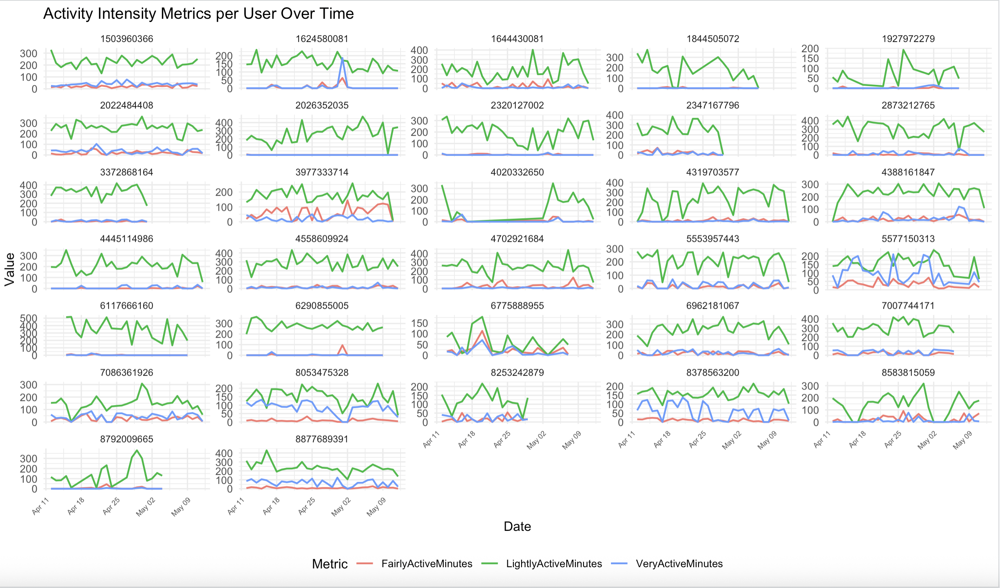
<br>
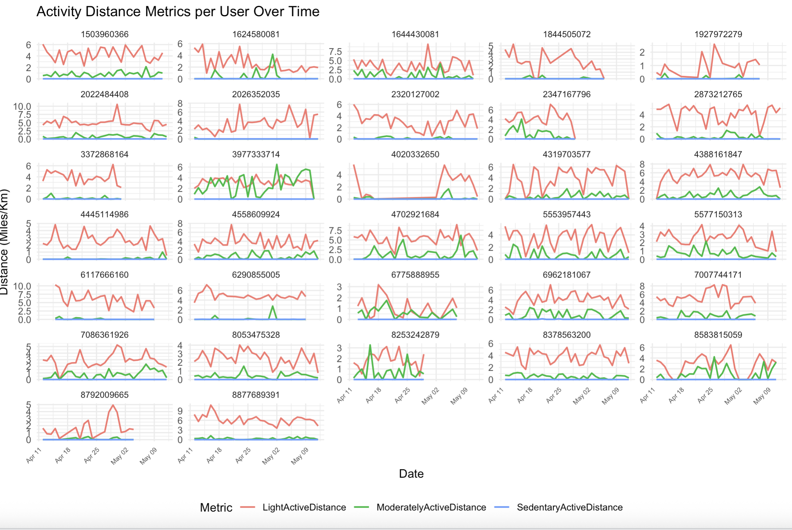
<br>

This bar graph shows that users exert the most activity during the evening, peaking between 6pm-8pm. This likely shows that users are exercising or completing light activity directly after work. There is another spike around what might be considered lunch where users might be getting in a quick workout or just walking more to get lunch.
<br>
<br>
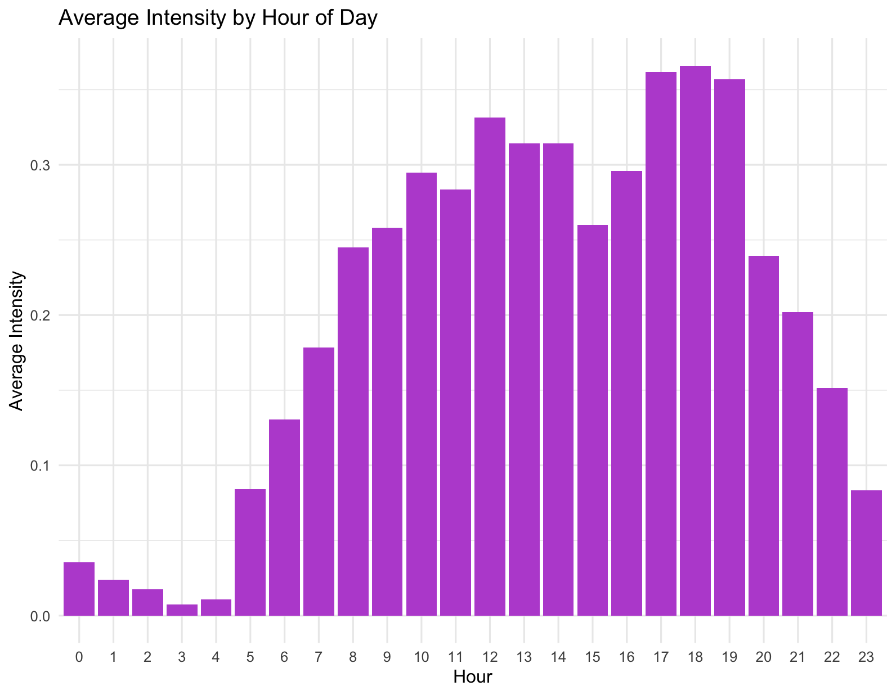
<br>

This bar graph shows that users have the most hourly steps during the evening
<br>
<br>
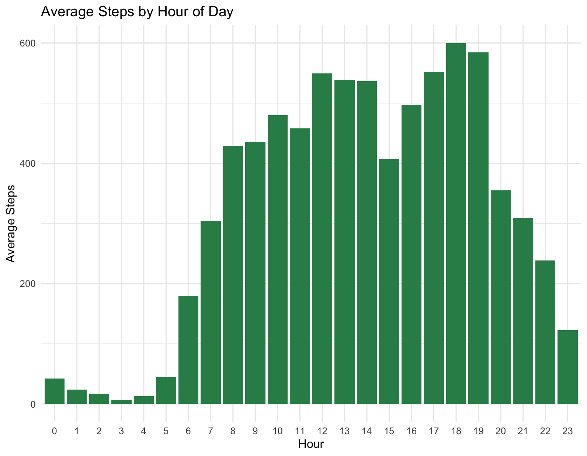
<br>
<br>
This chart shows the users sleep levels by day of the week with the highest amount of sleep on Sunday, which is also when users are getting the lowest step count and lowest active days per week. This suggests that most participants think of Sundays as "Rest days' and may be intentionally working out on other days of the week.

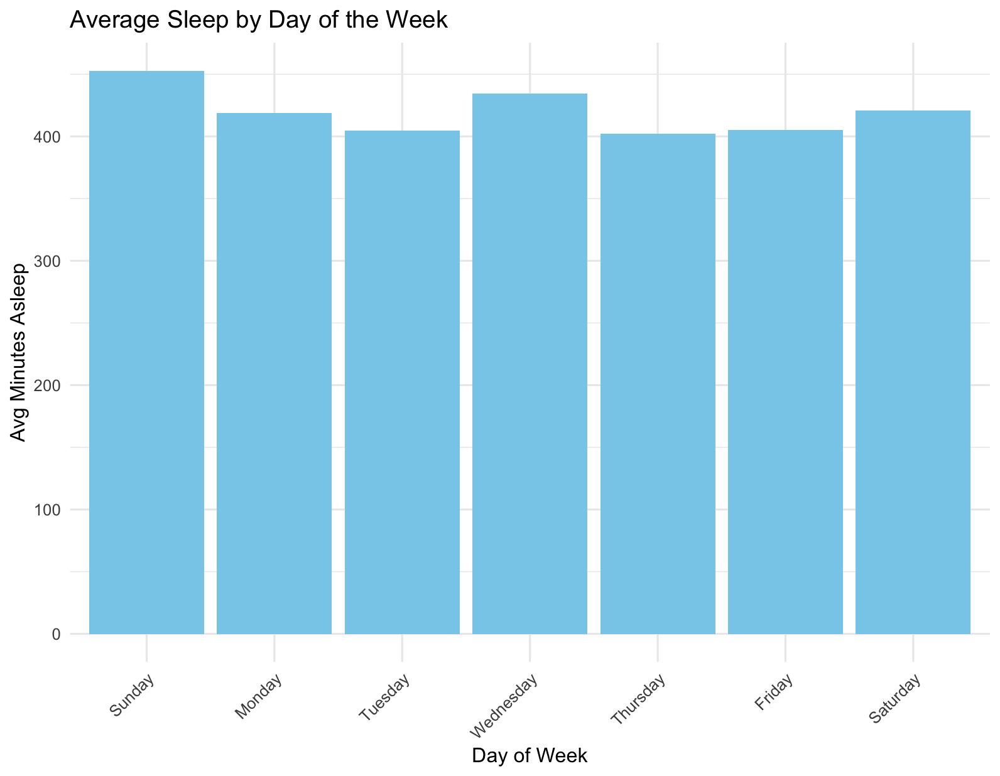

<br>
This chart shows the users sleep efficiency with the dashed line being perfect sleep efficiency and points below the line indicating sleep inefficiency. More time in bed has a strong positive correlation to more sleep. Some points far below the line may represent nights were users were in bed but had very low sleep duration.
<br>
<br>
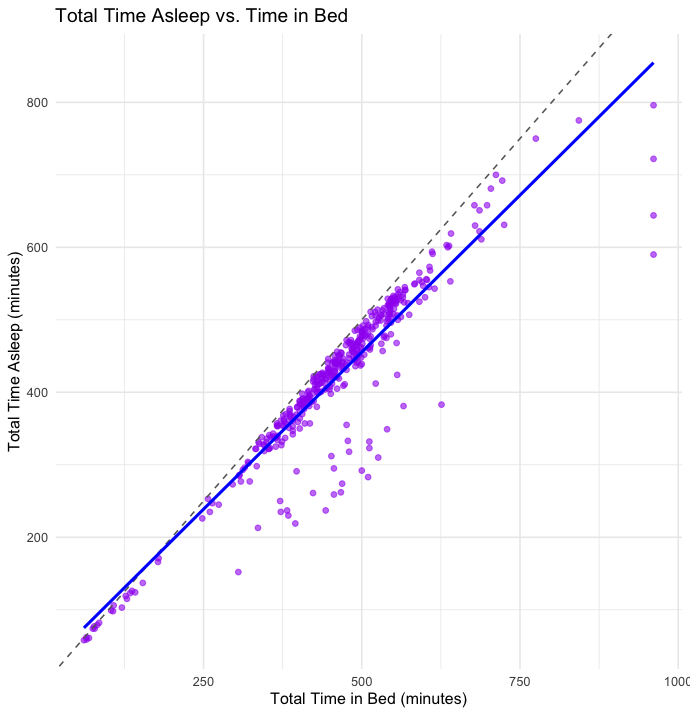


<br>
The scatter plot of steps vs. calories burned reveals a strong positive correlation. As users' daily step counts increase, their total calories burned also tends to rise. This suggests that physical activity, as measured by steps, is a significant contributor to daily energy expenditure. However, outliers indicate that other factors—such as non-step activities or metabolic differences—also influence calorie burn.
<br>
<br>
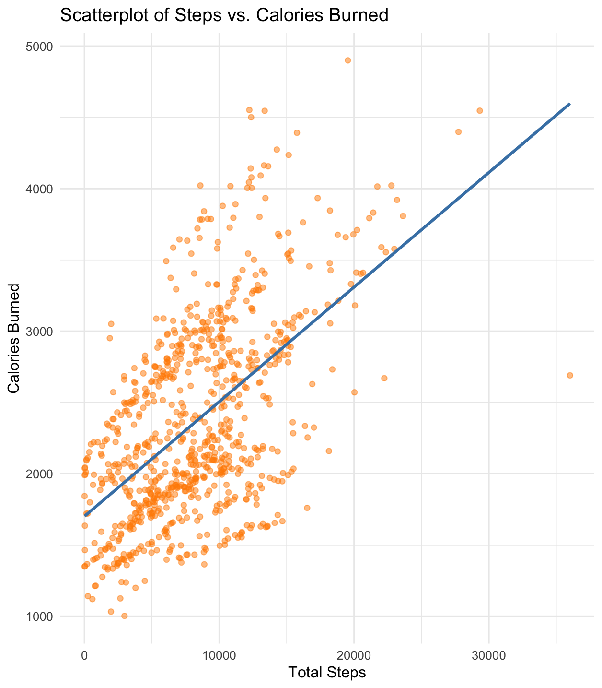
<br>
<br>
The scatter plot of total distance vs. calories burned also reveals a strong positive correlation. As users' daily distance increases, their total calories burned also tends to rise. This suggests that physical activity, as measured by steps, is a significant contributor to daily energy expenditure. 
<br>
<br>
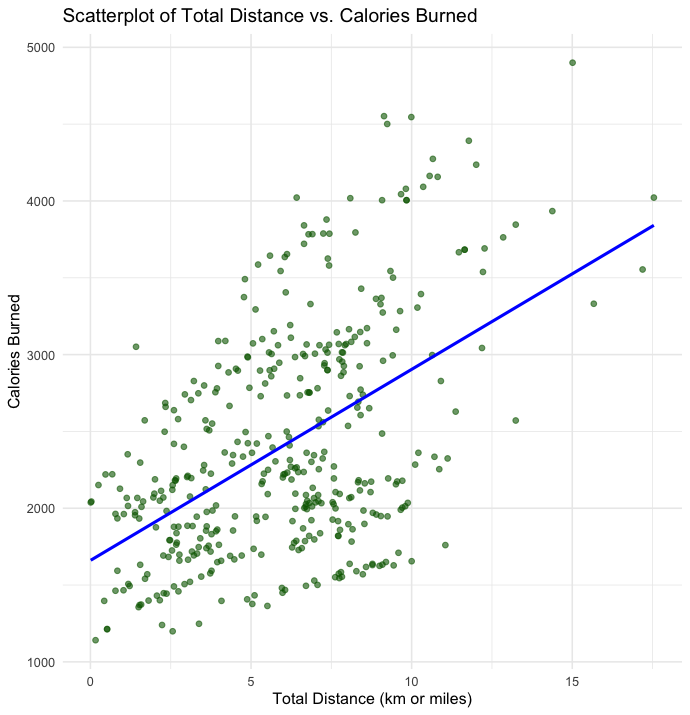
<br>
<br>


The scatterplot of average calories burned per day of the week also shows a correlation between the most calories burned on the highest activity day (Saturday) and the lowest amount of calories burned on the lowest activity day (Sunday).
<br>
<br>
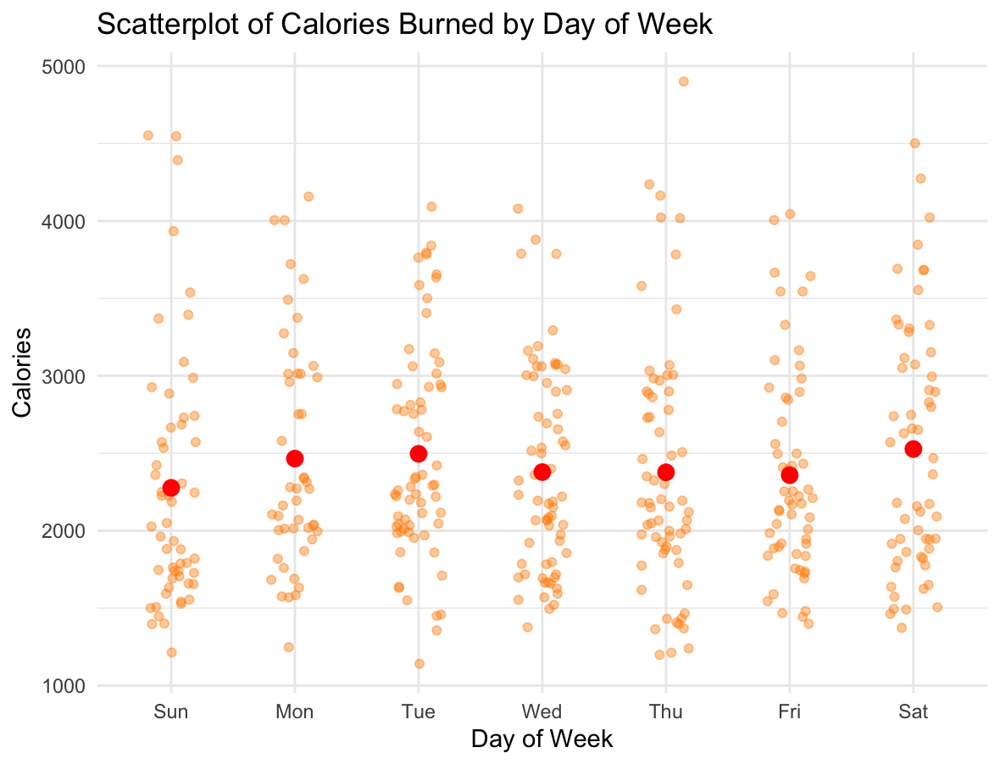

<br>
This bar graph shows that the average amount of calories also increases with expenditure, again correlating with the intensity of activity being between 6-8pm, likely when users are getting off work and exercising or running errands. Note that the hourly calorie burn is never at zero as users burn calories during rest.
<br>
<br>
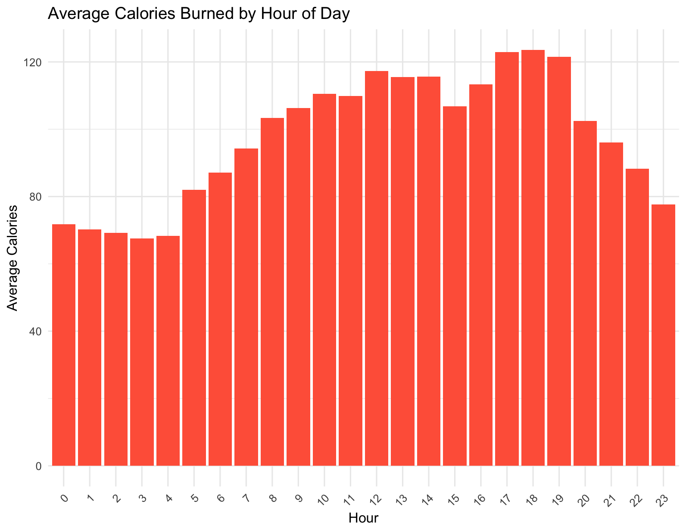
<br>

## 🎬 Act

According to CDC taking 8,000 steps per day was associated with a 51% lower risk for all-cause mortality (or death from all causes). Taking 12,000 steps per day was associated with a 65% lower risk compared with taking 4,000 steps. Bellabeat can encourage people to take at least 10,000 steps per day, explaining the benefits for their health. Sending notifications daily at different times will make users conscious of the number of steps achieved so far and encourage them to meet the set target of 10,000 steps according to CDC. 

The CDC also recommends that users should target heart-rates between 64% and 76% of their maximum heart rate. For high-intensity physical activity, the CDC recommends target heart rates between 77% and 93% of maximum heart rate.

Exercises such as joggling, light walking, aerobics all can help users reach their fat-burning zone, but it is still important to elevate your heart into the vigorous one from time to time for cardiovascular strength.

**When to target users**


### Awareness ###

The study's participants show the following characteristics:

**High Sedentary Time**: Many users exhibit prolonged periods of inactivity, indicating a sedentary lifestyle.

**Low Very Active Minutes**: A significant number of users have minimal very active minutes, suggesting limited engagement in high-intensity activities.

Ideally, we should obtain more data for an accurate analysis so we know which users to target. The data we analyzed did not include any demographic information such as gender, location, and age. It is difficult to create a set of user personas to target for marketing without additional data. We should consider collecting more data about the user, possibly with manual data collection during sign up. However, since Bellabeat already invests in Google Search, Facebook, Instagram and YouTube, they are already taking advantage of SEM (paid advertisements) and Social Media Marketing. These marketing strategies will best target these users with high sedentary times as they may be scrolling social media platforms during these times of low-activity. 

### Consideration ###

We could run the experiment again with a larger data set and for multiple concurrent months in order to build a case study which we can put on our website and try to get referenced in articles about our product. This case study would lend credibility and build trust with our customers. If our case study is referenced with backlinks directing users to the Bellabeat site, this will also increase our SEO (Search Engine Optimization) which could increase our web traffic. This strategy will likely lead to consideration by users who already know that wearable activity trackers exist but have not yet made a purchase.

### Conversion ###

One gap in our analysis was the lack of weightlog info as only 8 participants filled this part of the study out. Analysis also indicates that 61.2% of users also entered this data manually, increasing friction between the customer and the product. We should decrease this friction by running the case study for a longer period of time and collecting reasons that the data was not uploaded automatically. More automatic uploads may encourage users to continue using this product for weight tracking.

### Loyalty ###

Our goal is to turn active users into loyal brand followers, preferably customers who create UGC (User Generated Content). Our analysis earlier indicated that almost 75% of our users were highly engaged users who recorded 30-31 days of activity for the month. 

- We can pair with a point-award incentive system
- We can offer discount for birthdays or anniversaries
- We can offer discounts for users who leave reviews
- We can build a Bellabeat community to encourage social support, motivation, and sharing, which will increase loyalty.
- Re-marketing toward users who are currently using one of our devices (Leaf, Time, Spring) to encourage users to purchase other types of trackers. For instance, a user who is consistently using the Leaf (Belllabeat's classic wellness tracker) may be intersted in Spring, our water bottl which tracks daily water intake and hydration levels.

We should also implement gamification elements, such as challenges, badges, leaderboards, and streaks to motivate users to achieve their wellness goals. For example, only 24 out of 33 users tracked their sleep, indicating a potential area for increased engagement. For both sleep and activity monitoring, we can leverage peak times for marketing campaigns. For instance, we can send activity notifications between 6pm-8pm when users are most likely to start engaging in light to vigorous physical activity. We can also gently remind users who have a gap between total time in bed to sleep that there are some sleep hygeine practices such as turning off your television and making the room dark, whcih could reduce their time awake in bed to total time. They could track this number decreasing and we could correlate it to an increase in TotalSleep.


